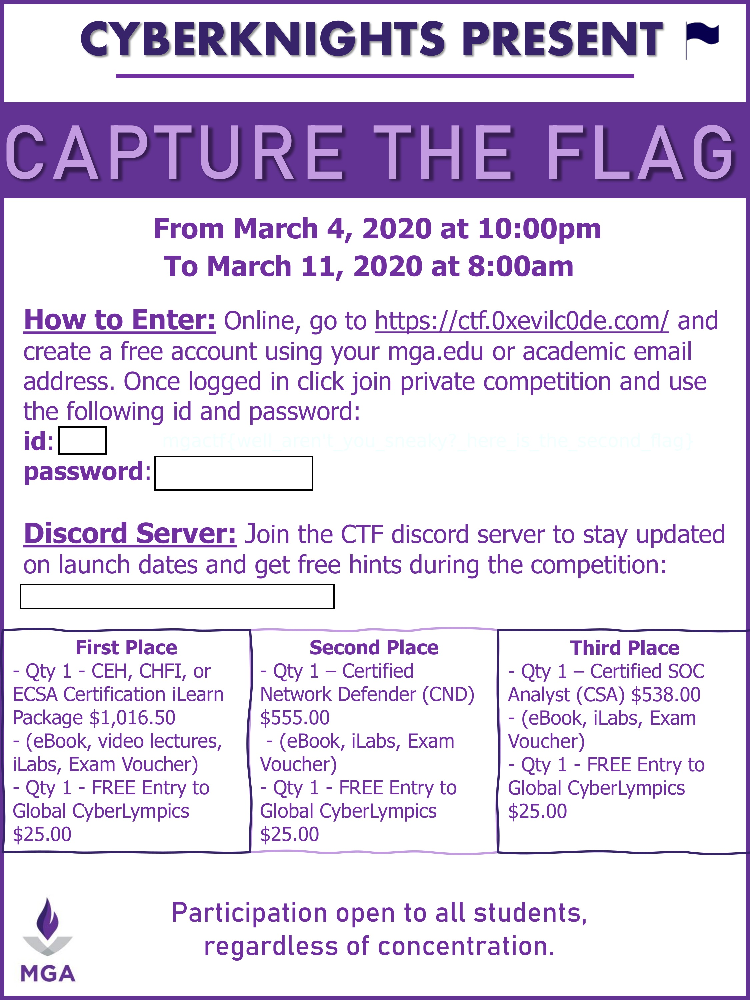
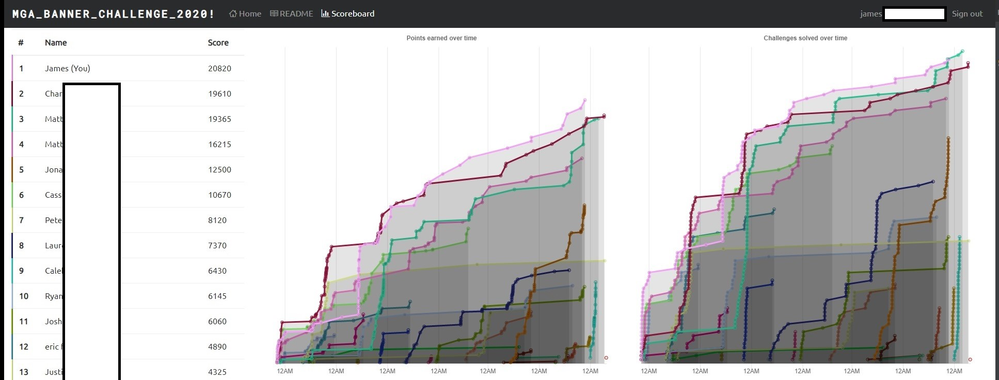

# MGA CTF 2020

This is the first Capture tha Flag competition that I fully competed in. I'm making this write-up so I can always 
come back later and review what I did and how I did it. I'm likely not going to enter all of the challenges, 
just the ones that I found particularly interesting or challenging.

My first competition win of hopefully many. I chose the ECSA training and exam voucher as my prize. 
I hope I don't waste it.

```
Final Score:    20,820
Final Rank:     🎉 1st Place 🎉
```

## Competition Banner



## Scoreboard

