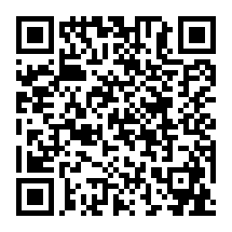

# MGA CTF 2020 – Decoding #7

* **Category:** Cryptography
* **Points:** 650

## Challenge

> You have heard the location of the hacker's meeting is being posted around town. 
Can you find the flag that gives the address? (use the attached file to solve this challenge)?


## Solution



We were given the QR code which led to the following encrypted text. 

> OIENKPAKOOELKNAIPJFMLPBKMEGBPBFEMJGMPMFJMIGNJHDCNEHBLLBONHHCKCAHMPGKKNAINIHNKLAOPEFBKGADMCGHLPBK

A lot of stress and a big hint later nad I discovered that this one used Citrix CTX1 encryption, found in 
[CyberChef](https://gchq.github.io/CyberChef/). A quick decode later and I found the flag!


```
MGACTF{5854_Columbus_Rd}
```