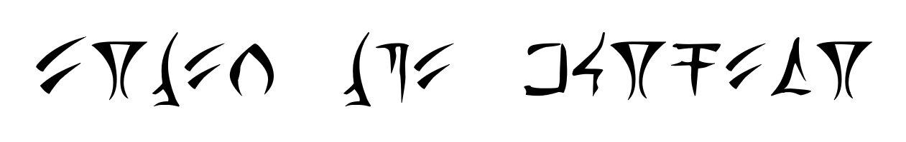

# MGA CTF 2020 – Markings

* **Category:** Cryptography
* **Points:** 200

## Challenge

> Some adventurers found these markings etched in a stone slab, 
what does it mean? (Enter the entire decoded string as your answer. use all lowercase letters)

## Solution



I just guessed this one after assuming the middle word was `the` and going from there. I'll edit this with the language
origin.

```
enter the dungeon
```