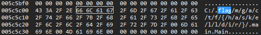
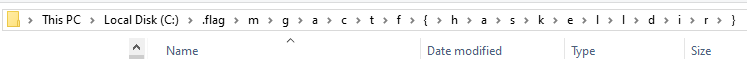

# MGA CTF 2020 – Haskell Hacker

* **Category:** Enumeration and Exploitation
* **Points:** 450

## Challenge

> We can't figure out what this file does, but we are sure it outputs a flag in some way. Please find the flag. 
Download the file from here: [REDACTED]

## Solution

**My method:** Normally the first thing I do is open up a hex editor and search for specific keywords. In this case, `mga`,
`ctf`, and `mgactf` are always the first I look for. Next I searched for `flag` and got a hit. 



**The correct method:** Check your C: drive



```
Flag: mgactf{haskelldir}
```