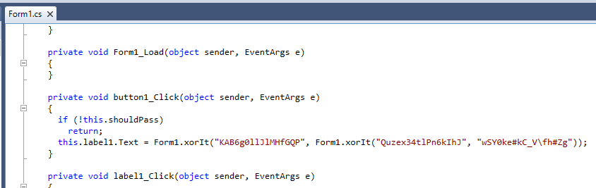

# MGA CTF 2020 – Hidden.exe Flag?

* **Category:** Enumeration and Exploitation
* **Points:** 800

## Challenge

> A flag has been hidden in this executable, but and the buttons don't seem to do anything.

## Solution

I used JetBrains dotPeek to take a look under the hood of this file. 



I was able to quickly find this and simply XOR those and there we go, the flag.

```
mgactf{secure-c}
```