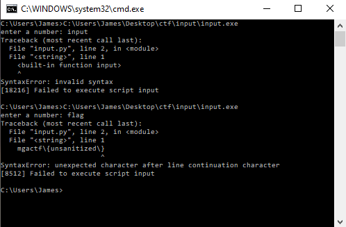

# MGA CTF 2020 – Python Hacker

* **Category:** Enumeration and Exploitation
* **Points:** 700

## Challenge

> This python exe seems to have an input vulnerability. Try to extract the flag.

## Solution

This one was pretty cool. I found out through hex edit that this was using Python 2.7, 
so I user that to look up input vulnerabilities in that version of Python. Apparently 
you can enter the **[input variable](https://www.geeksforgeeks.org/vulnerability-input-function-python-2-x/)** in `input()` and it will just print that out. I 
had to run `cmd /k` in order to hold the command window open, else it would close 
immediately. I guessed a few time at what the variable was and second try, it was `flag`



```
mgactf{unsanitized}
```