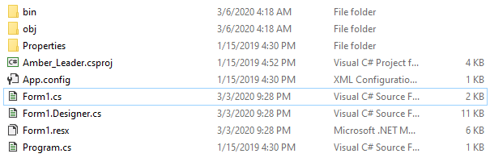

# MGA CTF 2020 – Amber Leader

* **Category:** Middle Georgia Wars
* **Points:** 150

## Challenge

> We have just received a message from the Amber Squadron Leader, Prof. Pedro. 
Please view the message he has sent and find out the flag. Message: [REDACTED LINK]

## Solution

Instead of a compiled file like in [hidden.exe](../exploits/hidden-exe-flag.md), I was given a project folder for a C#
assignment. Knowing that the typical default name for these projects is `Form1.cs` and that is generally where the code
content is placed, I checked that one first. Not always reliable, but it's worth noting the last modified date as well.



The flag is found as a comment at the bottom.

```
Flag: mgactf{EliteHackersUse.Net}
```