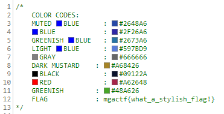
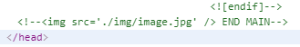
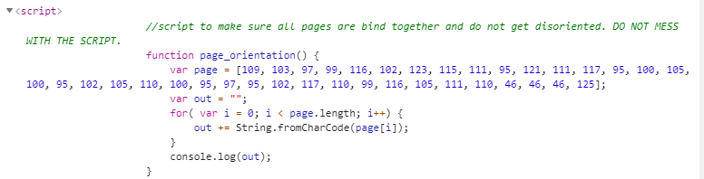

# MGA CTF 2020 – Cyan and Magenta Leader

* **Category:** Middle Georgia Wars
* **Points:** 100 / 200 / 200

## Challenge

> Cyan and Magenta Squadron Team Leaders have been working tirelessly from across the globe. Dr. Spangler and 
Dr. Sandoval are currently in Asia taking down the Chinese pirates. While working on the systems in Asia, both 
the team leaders found important information and have sent it in the best way possible. They have made it difficult 
for Bictor HamFord to find the flags. Please access [REDACTED] and find the flags they have sent us.

## Solution

These ones were easy except for the last one. 

1 - Check the .css



2 - Check for a commented out link



3 - [Convert the decimal](http://www.asciitable.com/) in the function script to ASCII



4 - Change the ending URL from `/blah.html` `/robots.txt` and follow the path to the secret place

```
mgactf{what_a_stylish_flag!}
mgactf{design}
mgactf{so_you_did_find_a_function...}
mgactf{robots_beep_boop}
```