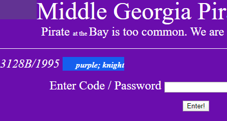
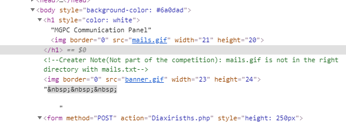
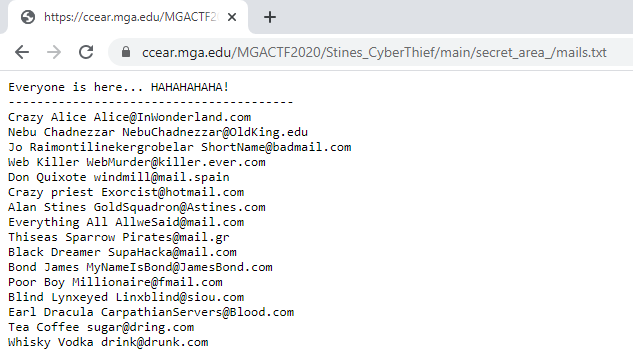

# MGA CTF 2020 – Gold Leader

* **Category:** Middle Georgia Wars
* **Points:** 100 / 200 / 300

## Challenge

> The Middle Georgia Cyber Patrol Gold Squadron has FINALLY found the website used by some filthy pirates. Middle 
Georgia Pirate Company was established in 1990. In 2007, they moved their operations online. They STEAL from the MGSU 
campus and sell it through their online portal. Their leader Bictor Hamford is a VERY cruel and vicious person. It is 
believed that Bictor is responsible for photoshoping the NASA moon landing image to deceive the entire 
planet. #HackThePlanet The Leader of the Gold Squadron, Prof. Alan Stines was so close to busting the racketeers
 when he was caught. The pirates do not know who he is and we have a plan to save him. According to the Pirate Code, 
 if Prof. Stines is able to tell the pirate a SECRET code, they would believe him and set him free. Your mission: 
 Figure out how did Prof. Stines hack [REDACTED] website. Once you have 
 access to the portal to find out the email address used by the Gold Sqadron leader Prof. Stines. Once you have 
 his email address, send an email to that email address. The Email message is: "Long Live Leeroy 
 Jenkins!" (he will know what it means and what to tell the pirates). On receiving the email, Prof. 
 Stines would immediately send you the flag as the confirmation. Get That Flag and our Gold Squadron Leader will 
 be free. REMEMBER, the website is OLD and there might be signs of OLD HTML tags. DO NOT GET CAUGHT IN A RABBIT HOLE. 
 Note: You are not required to contact ANYONE for this challenge. It is our humble request not to pester Prof. Stines 
 or any other professors. NO ONE except for the CREATOR knows the flag. Happy Flagging! 
 
1. Enter the username and password used to login (use the format username;password).
 
2. What is the Gold Squadron leaders email address?

3. What is the Flag?

## Solution

The first part was straight forward. Just hidden on the homepage with the same font as the background.



The "accidentally" left comment tag hinting at `mail.gif` leads to a new subdirectory `/main/secret_area_/mails.gif`



Change that to the suggested `mails.txt`



Lastly just send the email to Gold Squadron Leader and 
```
mgactf{6515}
```