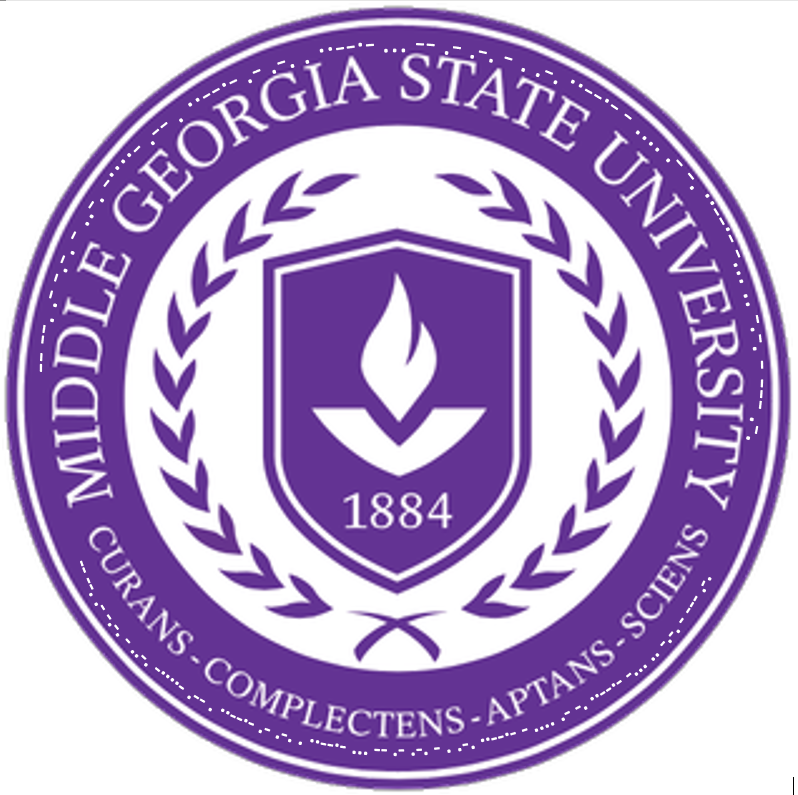

# MGA CTF 2020 – Grey Leader

* **Category:** Middle Georgia Wars
* **Points:** 350

## Challenge

> It just got announced that Dr. Kim Joobum will be the new Grey Squadron Leader. As the Grey Squadron leader 
Dr. Joobum will be responsible for the Network Security of our Middle Georgia Campus. Dr. Joobum is quite 
familiar with the works of pirates and has been successful in the Asian network. As a standard protocol, 
MGSU logo was sent to Dr.Joobum. He has replied with this message back. Please decode the message. 
What is the Flag?

## Solution

This one was awfully annoying to read but very straightforward



```
mgactf{we_are_smarter_than_bictor}
```