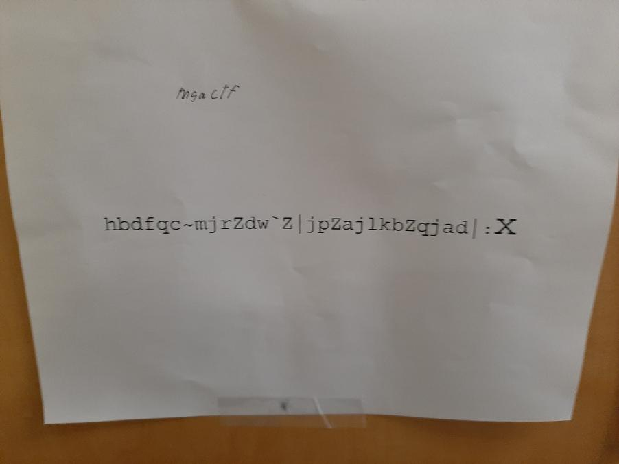

# MGA CTF 2020 – Teal Leader

* **Category:** Middle Georgia Wars
* **Points:** 750

## Challenge

> Teal Squadron Leader, Dr. Jenkins is the master of obfuscation. His past time hobbies include “causing pain” to his 
team members/ and rookie learners. It is reportedly noted that his most famous sentence is, “There is an interesting 
NSA puzzle on my door…”. Teal Leader has been actively fighting off the corrupt MGPC pirates. In, his effort to do 
so he has found a vital information. The Squadron Leader has used his skills of obfuscation and sent a message. 
What is the flag in the message?

## Solution



The master of obfuscation strikes again. The code included was pretty much useless. Just go to Dr. Jenkins door for the
below code and XOR it with a key length of 5. I used [CyberChef's](https://gchq.github.io/CyberChef/) XOR Brute 
Force to guess the key. 


```
mgactf{how_are_you_doing_today?}
```