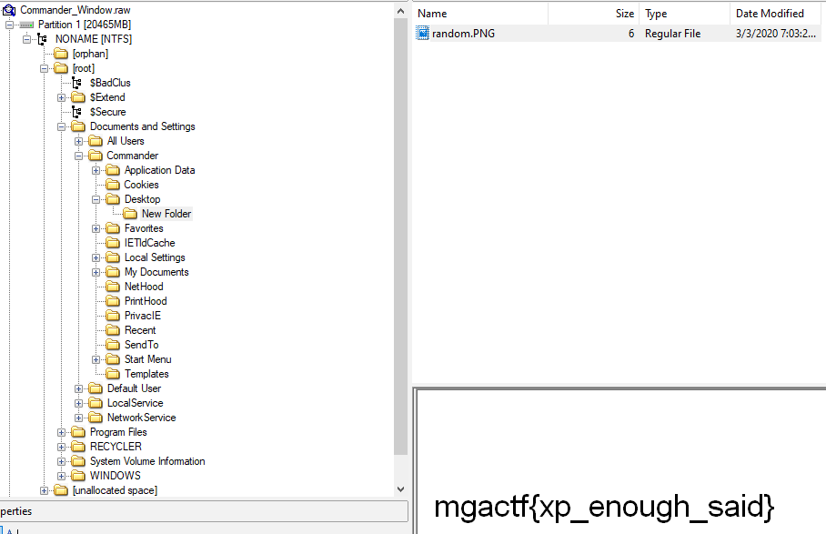
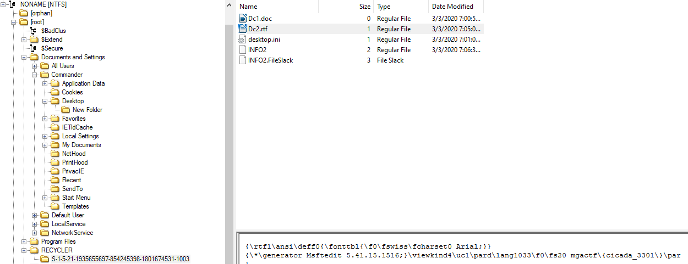

# MGA CTF 2020 – The Commander

* **Category:** Middle Georgia Wars
* **Points:** 150 / 100 / 150 / 100

## Challenge

> The Commander, Dr. Yerby has again and again proved that he is the best forensics investigator that we 
have got. He is currently on a mission to expose Bictor HamFord. It is said that Dr. Yerby once saw Bictor 
and almost hacked into his AOL account (yes, AOL, this was back in their days...). The Commander is away 
from the screen currently and we have a reason to believe that some of his files have been compromised. 
The team has taken a acquired his computer files and stored it in the .raw format for you to investigate 
it. Use your forensics software and skills to find the corrupt document and files. The copy of the .raw 
file can be found on [REDACTED]. We don't know if you'll need the username and password. If you do, the 
commander's username and password are: Username: Commander PW: forensicsthebest 

1. What is the flag in the .PNG file?

2. What is the flag in the .doc file?

3. What is the .wma file flag?

4. What is the flag in the .rtf file?

5. What is the flag in the favorite/ History of the IE ?

## Solution

[FTK Imager](https://accessdata.com/product-download/ftk-imager-version-4-2-0) made this one pretty simple. I just had to navigate around a bit until I found the files

