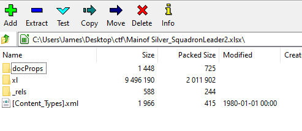

# MGA CTF 2020 – White Leader

* **Category:** Middle Georgia Wars
* **Points:** 750

## Challenge

> White Team Leader, Dr. Girard is the leading System Analysis squadron leader. Dr. Girard was working on a very 
important document when he went missing. We have a reason to believe that he left a flag for us to uncover a mystery. 
Please find flag from the excel file.

## Solution

This challenge arrived in a .xlsx file, which an Excel file that is technically a zip file. 



Opening it up in Excel is not going to yield any results, but once unzipped and the right file is found, 
it is easily found. This one was in sharedStrings.xml

```
mgactf{Creator_of_This_Challenge_Is_A_Monster}
```