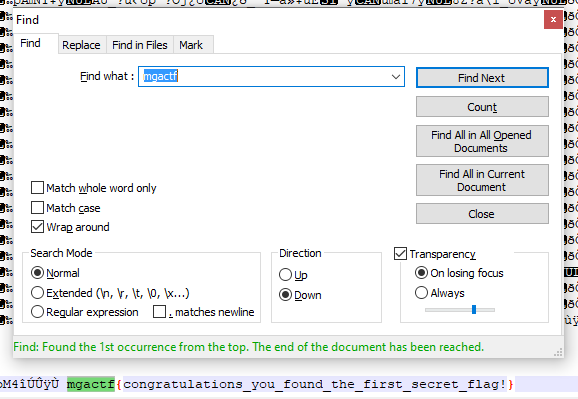

# MGA CTF 2020 – Secret Flag 1

* **Category:** Miscellaneous
* **Points:** 200

## Challenge

> Curious? Hidden somewhere outside of this ctf environment is several secret flags, if you find one 
submit it to its respective challenge.

## Solution

This is probably my favorite one of the competition because I found it really clever. The banner image that was 
sent out to students to advertise the competition had two flags secretly hidden in it. One found with a hex editor
and the other after making some adjustments in [paint.net](https://www.getpaint.net/)



```
mgactf{congratulations_you_found_the_first_secret_flag!}
```