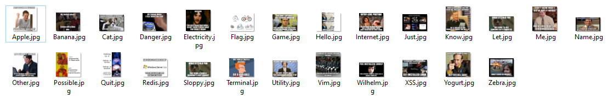
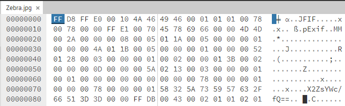
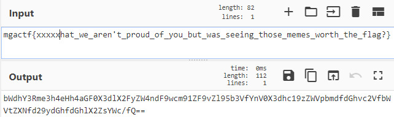

# MGA CTF 2020 – Memes...

* **Category:** Script Kiddie
* **Points:** 610

## Challenge

> We were planning on just giving you the flag this time... but some hackers stole the flag! What's worse is they 
exfiltrated the flag using a bunch of terrible memes. Can you figure out what the flag is? llink:

## Solution



This one had me lost for a while. I looked at it in a hex editor for a while but didn't notice much, until I chose to
look at `Zebra.jpg`



All the others had a seemingly random bit of characters that changed on each file which I just assumed was normal. I
looked at `Zebra.jpg` and saw the tell-tale sign of a base64 encoding. To find the flag, I worked backwards from there.



I should have probably wrote a script for this but it was like 3am and my brain hurt.

```
mgactf{not_that_we_aren't_proud_of_you_but_was_seeing_those_memes_worth_the_flag?
```