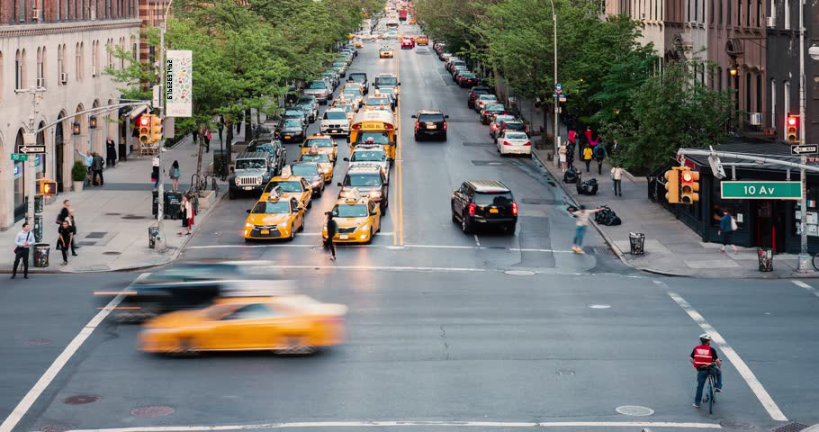
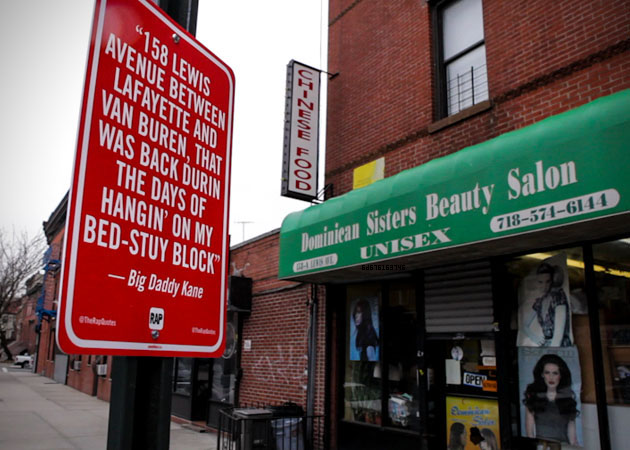

# MGA CTF 2020 – Hidden Bits

* **Category:** Steganography
* **Points:** 450

## Challenge

> We have reason to believe information has been hidden within these three images. Can you find the hidden flag?

## Solution

There were three given images to look over. Zooming in on 1 and 3 (shown below) showed some kind of code. I couldn't 
immediately find the code in the second image, but I didn't need it. Running the two images I had through a hex-english 
converter, I got the answer `mgactf{bitb`. I figured that the last string would be roughly the same length and that `}` 
had to be the last character. A couple guesses later and I had the answer

 

```
mgactf{bitbybit}
```