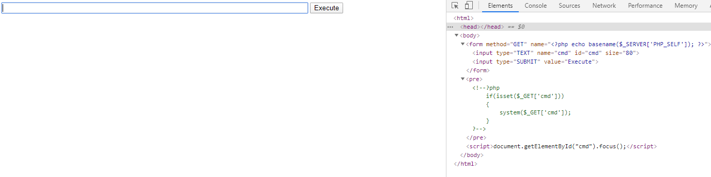
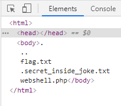
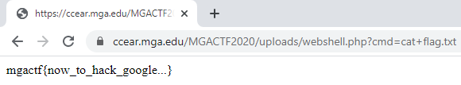

# MGA CTF 2020 – A Hacker was here...

* **Category:** Web
* **Points:** 150

## Challenge

> While browsing through the uploads folder on our webserver we discovered a suspicious file; see if you can use 
it to find the flag hidden on the webserver. Link: [REDACTED]

## Solution

The title of the challenge gives this one away. I used 
[my favorite little web shell](https://gist.github.com/joswr1ght/22f40787de19d80d110b37fb79ac3985) 
for this one. Hit `F12` in your browser and edit the `Elements` tab to include the code in that link. In this case, 
I just deleted everything originally on the page, but your mileage may vary with doing that and it might require 
some more code manipulation.



Enter `ls -a` to list all of the options.



Now, while completely ignoring the secret inside joke, the easiest way to go on from here is looking at the URL. You 
can see that the previous entry is in there. Now just edit that to be `?cmd=cat+flag.txt` and hit enter. 



```
Flag: mgactf{now_to_hack_google...}
```