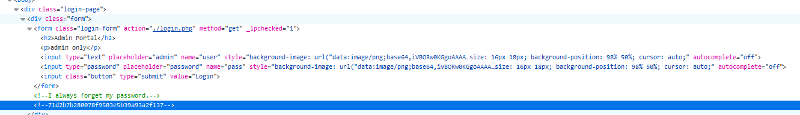

# MGA CTF 2020 – Admin Portal

* **Category:** Web
* **Points:** 450

## Challenge

> Recently someone has been logging into our admin portal and messing with our sever but we have no idea how they're 
getting in. Try to log into our admin portal and you just may get a flag. Link: https://ccear.mga.edu/MGACTF2020/web2/

## Solution

You notice something when searching using typical F12 approach. I noticed it was a md5 hash. I decrypted it to produce the results "bigsecret" and usually default admin username is admin so that + the password got me inside the website which shown the flag. 



```
Flag: mgactf{so_not_secure}
```
