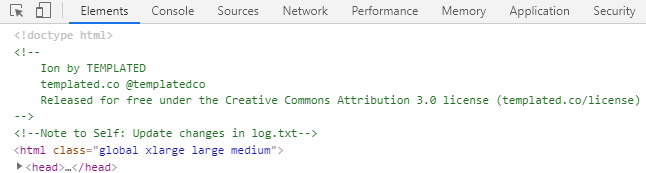
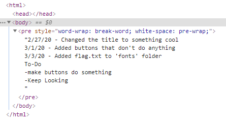

# MGA CTF 2020 – Tribute

* **Category:** Web
* **Points:** 300

## Challenge

> We came across this page, see if you can find a flag. Link: [REDACTED]

## Solution

The first thing to do on any website is to `F12` to check out the comments. 



Bingo! Now we navigate over from `/web1/index.html` over to `/web1/log.txt` and see what is there. 



Perfect. Now over to `/web1/fonts/flag.txt` for the flag

```
Flag: mgactf{TenaciousD}
```