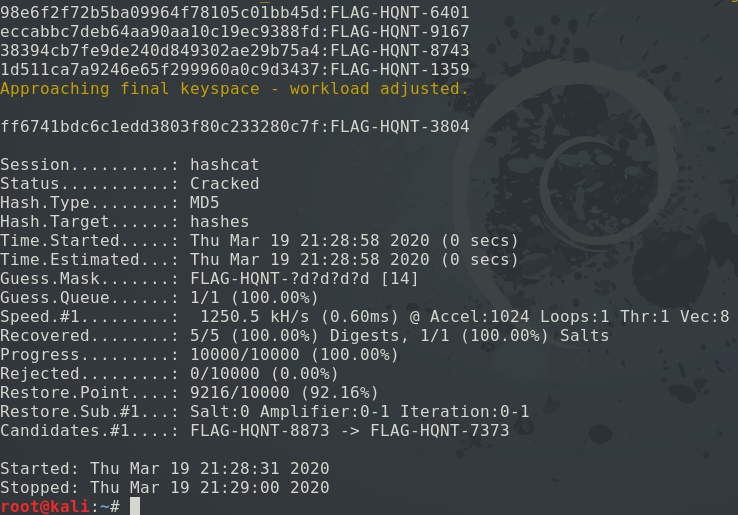

<h3>Using hashcat to crack MD5 hashes:</h3>

On Kali, unzip the rockyou.txt wordlist:
```
# sudo gunzip /usr/share/wordlists/rockyou.txt.gz
# wc -l /usr/share/wordlists/rockyou.txt
```

Passwords from the rockyou.txt wordlist:
```
# nano hashes
[ Enter hashes to crack, line by line ]
# hashcat -m 0 hashes /usr/share/wordlists/rockyou.txt
```
`-m 0` : Specify MD5\

Passwords with known characters (Mask Attack). This will crack hashes that start with `FLAG-HQNT-` and use 
hashcat's built-in character set to attempt all digits:
```
# nano hashes
[ Enter hashes to crack, line by line ]
# hashcat -a 3 -m 0 hashes FLAG-HQNT-?d?d?d?d
```
`-a 3` : Specify mask attack\
`-m 0` : Specify MD5

