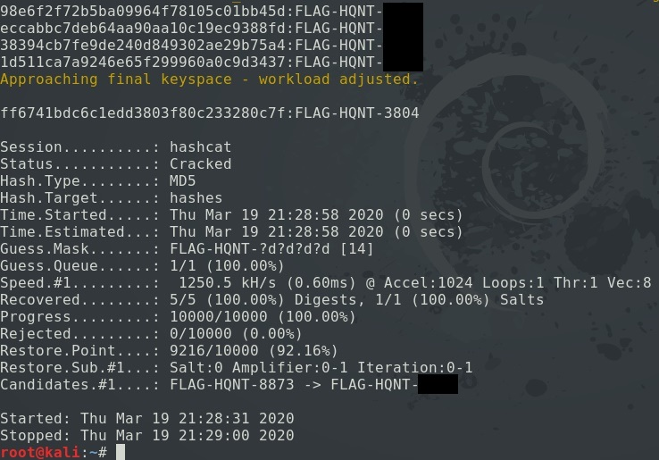

<h3>Using hashcat to crack MD5 hashes:</h3>

<h5>Finding unknown hash type</h5>
```
# hashid -m [hash]
```
`-m` : outputs hashcat id to use

<h5>On Kali, unzip the rockyou.txt wordlist:</h5>
```
# sudo gunzip /usr/share/wordlists/rockyou.txt.gz
# wc -l /usr/share/wordlists/rockyou.txt
```

<h5>Crack password hashes from the rockyou.txt wordlist:</h5>
```
# nano hashes
[ Enter hashes to crack, line by line ]
# hashcat -m 0 hashes /usr/share/wordlists/rockyou.txt
```
`-m 0` : Specify MD5\

<h5>Passwords with known characters (Mask Attack)</h5>
This will crack hashes that start with `FLAG-HQNT-` and use hashcat's built-in character set to attempt all digits:
```
# nano hashes
[ Enter hashes to crack, line by line ]
# hashcat -a 3 -m 0 hashes FLAG-HQNT-?d?d?d?d
```
`-a 3` : Specify mask attack\
`-m 0` : Specify MD5

<h5>hashcat built-in character sets:</h5>
```
?l = abcdefghijklmnopqrstuvwxyz
?u = ABCDEFGHIJKLMNOPQRSTUVWXYZ
?d = 0123456789
?h = 0123456789abcdef
?H = 0123456789ABCDEF
?s = «space»!"#$%&'()*+,-./:;<=>?@[\]^_`{|}~
?a = ?l?u?d?s
?b = 0x00 - 0xff
```

